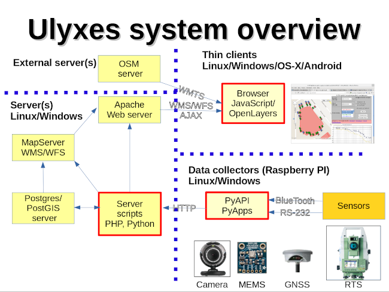
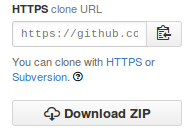
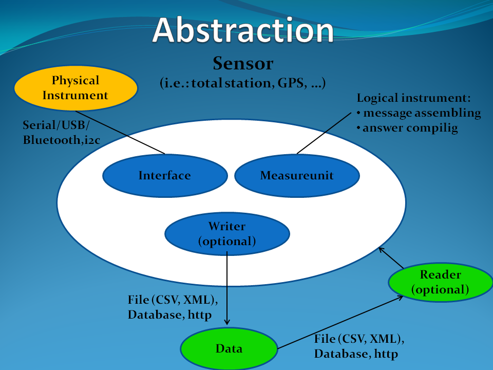

.. ulyxes_user_documentation

######
ULYXES
######
English User Documentation 2015
-------------------------------

.. topic:: Overview

    This documentation stands as an User Manual of `Ulyxes <http://www.agt.bme.hu/ulyxes/>`_ system. The main aim of it is to represent the Ulyxes system and describe the usage of it with given examples and tutorials.

    :Date: 2015-09-13
    :Authors: **Daniel Moka** <mokabme@gmail.com>, **Zoltan Siki** <siki@agt.bme.hu>
    :Version: 1.0

.. contents:: 
    :depth: 5

.. sectnum::

.. raw:: LaTeX

   \newpage

Introduction
############

Ulyxes is an open source project to drive Robotic Total Stations (RTS) and
other location aware sensors and publish observation results on web based maps 
(GPL 2). The name of Ulyxes come from the Greek Odysseus who was a legendary
Greek king of Ithaca island. Or it can be resolved as Ultimate Y X Estimation
System.

The first aim of the project is to create a framework to drive different 
location aware sensors from a computer, furthermore publish the data on the
Internet. The project is based on several open source projects and programming
languages. The overview of the system can been seen on the following figure:

    Ulyxes system overview

System Divisions
################

Publisher Interface
*******************

The first part of the system is the publishing interface where the measurement
results and the related analysis are published in the form of maps, tables and 
graphs with the associated Geo-spatial visualization. The interface works within
an Internet browser (e.g. Mozzila Firefox or Google Chrome) which supports to
run Javascript. As for operation system, the interface is cross-platform so it
can be used on any operation system.

Servers
*******

There are number of open source server projects contribute the back-end
operation of the system. In order to store the observation data in databases,
Ulyxes uses PostgreSQL/PostGIS object relational database. The data flow from 
the database to the web-server is solved by using PHP scriptins or MapServer. 
The webserver is driven and supported by the Apache Web Server. In addition, 
other possibilities and alternatives can be used to solve the server side works,
for example a Map Server (Web Map Service - WMS) can be also an effective 
solution.

Sensor Managers
***************

The system contains two different API independent from eachother: the 
**TclAPI** and the **PyAPI**. The TclAPI is the old and its development is 
finished. Tha PyAPI is the new and actively developed.

TclAPI
======

The TclAPI consist of a couple of Tcl (Tool Command Language) files/procs which
give a higher level interface to drive RTSs and GPSs from computer. The TclAPI 
is released under GNU GPL V2.0. This API is obsolate and no new functionality
will be added. It has been already tested with the following type of
instruments:

    * Leica TCA1800 
    * Leica TPS120x
    * Leica TPS110x 
    * Leica DNA03 
    * Trimble 550x 
    * Garmin GPS18 
    * Leica GPS 500 

Specification
^^^^^^^^^^^^^

*Supported OS (Operating System):*

    * Linux (probably any distro, tested on Fedora and Ubuntu) 
    * Windows XP/Vista/7 (32 and 64 bit) (tested on XP/7) 
    * any other OS with Tcl 8.3 or newer installed (not tested)

|

*Requirements:*

    * Tcl (Tool Command Language) 8.3 or newer must be installed 
    * at least one serial port or USB to serial converter (tested with Prolific)
    * serial cabel to connect the instrument to the computer 

How to install Tcl/Tk
^^^^^^^^^^^^^^^^^^^^^

*Linux (Ubuntu/Debian):*

    1. Open a terminal
    2. Type: *sudo apt-get install tk8.5 tcl8.5* 

.. note::  The apt-get command is a powerful command-line tool, performing such functions as installation of new software packages, upgrade of existing, so on. For more info, visit: https://help.ubuntu.com/lts/serverguide/apt-get.html

*Windows:*

These steps can be also found at http://trac.osgeo.org/osgeo4w/

    1. Download the 32bit (http://www.activestate.com/activetcl/downloads) or 
       the 64bit installer
    2. Run the installer

..Note:
    * OSGeo4W installer also install Tcl/Tk, you can use it also

How to install TclAPI
^^^^^^^^^^^^^^^^^^^^^

The TclAPI is a part of Ulyxes system. In order to install the API, the whole Ulyxes project folder has to be installed.

*If you have git client installed on your machine:*

    1. Open a terminal
    2. Go to or make the desired “MyFolder” you want to install Ulyxes/TclAPI
    3. Clone the Ulyxes Git directory, so type: git clone https://github.com/zsiki/ulyxes.git
    4. The TclAPI can be found at: “MyFolder/Ulyxes/TclAPI”

*If you have no git client on your machine:*

    #. Open your browser
    #. Navigate to `Ulyxes Github page <https://github.com/zsiki/ulyxes>`_ 
    #. Press the **Download ZIP** button (right side, down)
    #. Uncompress the downloaded file to a suitable directory

    Download Ulyxes ZIP folder

PyAPI
=====

First of all the TclAPI is only able to control total stations and GPSs. The
usage of such instruments does not raise controversies, however other sensors
(i.e. web-cameras or Miro-Electro-Mechanical (MEMS) Sensors) can be also 
effectively used for certain motion monitoring tasks. Furthermore, as for the 
long term tasks the changes of the atmosphere influence our measurements, 
therefore meteorological sensors should be used to determine the meteorological 
elements which with the total stations can be maintained. To easily integrate 
such a different kind of instruments to the system, we decided to rethink our 
system so the PyAPI was created which is based on Python object oriental
language (OOP). Python is a general purpose high-level programming language
that provides a very fast development and testing tools for the user. It has 
countless additional library which can significantly contribute and help the 
programmers' work. Last but not least the biggest commercial and open source 
applications (QGIS, ArcGIS) have selected Python for development tool. (For 
more info, visit https://www.python.org/)

PyAPI is an Application Programming Interface (API) provides several classes to
handle different sensors e.g. Totalstations, NMEA GNSS receivers, MEMS sensors,
web-cameras. The API still only has a beta version.

Specification
^^^^^^^^^^^^^

*Supported OS (Operating System):*

    * Linux (probably any distro, tested on Fedora, Ubuntu, Raspbian) 
    * Windows XP/Vista/7/8/10 (32 and 64 bit) (tested on XP/7) 
    * any other OS with Python 2.7.x/3.x installed (not tested)

*Requirements:*

    * Python 2.7.x/3.x
    * at least one serial port or USB to serial converter (tested with Prolific)
    * serial cabel to connect the instrument to the computer 
    * I2C interface for MEMS (Raspberry PI)

How to install Python 3.x
^^^^^^^^^^^^^^^^^^^^^^^^^

.. warning:: TODO: How to install python 2 or 3...

Required Python modules
^^^^^^^^^^^^^^^^^^^^^^^

*Standard modules*:

    * datetime
    * json
    * logging
    * math
    * os
    * re
    * sys
    * tempfile
    * time
    * urllib
    * urllib2
    
*Extra modules*:

    * serial
    * smbus
    * wifi 
    * numpy
    * PyQt4.QtCore
    * PyQt4.QtXml
    
*External dependencies*:
    * GNU Gama

How to install PyAPI
^^^^^^^^^^^^^^^^^^^^

The PyAPI is a part of Ulyxes system. In order to install the API, the whole Ulyxes project folder has to be installed.

*Linux*

    1. Open a terminal
    2. Go to or make the desired “MyFolder” you want to install Ulyxes/PyAPI
    3. Clone the Ulyxes Git directory, so type: git clone https://github.com/zsiki/ulyxes.git
    4. The TclAPI can be found at: “MyFolder/Ulyxes/PyAPI”

*Windows*

    1. Go to https://github.com/zsiki/ulyxes.git Ulyxes Git website 
    2. On the website, you can find a “Download ZIP” button at the bottom right part
    3. The downloaded Ulyxes directory will contain the PyAPI

PyAPI Modules
#############

(For more detailed information and sources codes about modules of PyAPI, please visit the `official developer documentation <http://www.agt.bme.hu/ulyxes/pyapi_doc/>`_ of PyAPI  )

    Sensor Abstraction

|

*There are three groups of modules used by PyAPI:*

PyAPI Object-Model modules
**************************

The first group consist of modules which build up the logical model between sensors, interfaces and the writer.

Independent modules
*******************

angle.py
========

This module stands for storing angle value of numbers in radian internally. Using this class the angle conversions can be easily done. 

|

Supported angle units:

    * RAD  radians (e.g. 1.54678432)
    * DMS sexagesimal (Degree-Minit-Second, e.g. 123-54-24)
    * DEG decimal degree (e.g. 25.87659)
    * GON gradian whole circle is 400g (e.g. 387.7857)
    * NMEA ddmm.mmmm used in NMEA sentences (e.g. 47.338765)
    * PDEG pseudo sexagesimal (e.g. 156.2745 = 156-27-45)
    * SEC sexagesimal seconds
    * MIL mills the whole circle is 6400 mills

|

.. code:: python

    #Create Angle object with the given value and unit
    a1 = Angle("152-23-45", "DMS")
    #Convert a1 "angle" object to supported units
    for u in ['RAD', 'DMS', 'GON', 'NMEA', 'DEG', 'PDEG', 'MIL']:
        print (a1.GetAngle(u))

Readers
=======

reader.py is the base class for all readers (virtual).

filereader.py
^^^^^^^^^^^^^

Class to read file. It is mostly used as a base class for other readers
loading information from file.

.. code:: python
    
    # create a filereader object
    fr = FileReader('test', 'test.txt')
    # print the lines
    print (fr.GetLine())

csvreader.py
^^^^^^^^^^^^

Class to read csv file, first line must contain field names.
Default separator is semicolon (;).

.. code:: python

    # create a csvreader object
    cr = CsvReader('test', 'test.csv')
    # load the whole file into a list
    lines = cr.Load()

georeader.py
^^^^^^^^^^^^

Class to read GeoEasy geo and coo files.

External Python modules
***********************

Logging
=======
This module defines functions and classes which implement a flexible event logging system for applications and libraries.

For more information, please visit the `official Logging documentation <https://docs.python.org/2/library/logging.html>`_.

Pyusb
=====
The PyUSB module provides for Python easy access to the host machine's Universal Serial Bus (USB) system.

For more information, please visit the `official PyUSB Github page <https://github.com/walac/pyusb>`_.

Pyserial
========
This module encapsulates the access for the serial port. It provides backends for Python running on Windows, Linux, BSD (possibly any POSIX compliant system), Jython and IronPython (.NET and Mono).

For more information, please visit the `official PySerial documentation <http://pyserial.sourceforge.net/pyserial.html#overview>`_.

Smbus
=====

Cv2/cv (OpenCV)
===============
OpenCV (Open Source Computer Vision Library: http://opencv.org) is an open-source BSD-licensed library that includes several hundreds of computer vision algorithms.

For more information, please visit the `official OpenCV documentation <http://docs.opencv.org/modules/core/doc/intro.html>`_.

PyAPI Tutorials
###############

Use the SerialInterface
***********************

.. code:: python

    from serialiface import SerialIface
    si = SerialIface('test', 'COMx')
    si.Send('%R1Q,9028:0,0,0')
    %R1P,0,0:

Sensor Creation
***************

PyAPPS Applications Tutorials
#############################

MeasureToPrism
**************

Observations to a single pism, point.

Measurematrix
*************

NMEA_demo
*********

Horizsection
************

Section
*******

Monitoring
**********

This block consist of several apps to solve simple tasks for monitoring.

- *FileMaker* creates an input file for monitoring using manual targeting
- *FileGen* creates an input file for monitoring from coordinates automaticly
- *Blindorientation* search for a prism from a known station az calculate orientation
- *Robot* makes automatic observation using a file from FileMaker or FileGen
- *Robotplus* complex monitoring application using FileGen, Blindorientation and Robot

FileMaker
=========

It is a simple interactive app to create input file for monitoring observations.
First set up the total station on a known point and set the orientation.

Usage: filemaker.py output_file [sensor] [serial_port]

Start the application. Two types of output files can be generated, CSV dump 
(.dmp) or GeoEasy (.geo) file.
First it will prompt for the id of the station and the station coordinates.

For each target points the id and mode must be entered.

Target modes:

- ATR*n* use automatic targeting, n is prism type id (1/2/3/...)
- PR*n* prism with manual targeting
- RL reflectorless distance with manual targeting
- RLA automatic reflectorless ditance measurement to given direction
- OR orientation direction, manual targeting, no distance

.. NOTE::
   Generated output file cannot be used for Blindorientation because
   distance missing!

FileGen
=======

Blindorientation
================

Robot
=====

Robotplus
=========
